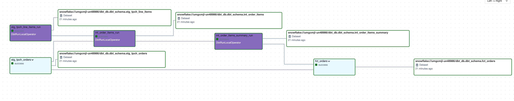
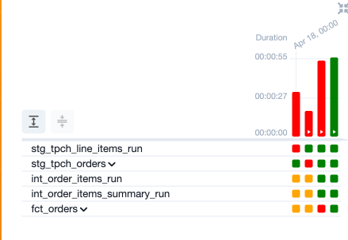

# ELT-TPCH

This project implements an ELT (Extract, Load, Transform) pipeline using the TPCH dataset from Snowflake, orchestrated with Apache Airflow. It serves as a demonstration of building scalable data pipelines for analytical processing.

## Project Overview

The ELT-TPCH project extracts data from Snowflake's TPCH dataset, transforms it using dbt, and orchestrates the workflow with Apache Airflow. The implementation follows industry best practices for enterprise-grade data pipelines.

### TPCH Dataset

The TPCH dataset is a standard benchmark for evaluating database system performance. It simulates a business scenario involving orders, customers, and suppliers, providing a comprehensive dataset for testing data processing workflows.

## Architecture Components

### 1. Snowflake RBAC Setup
- Defined and managed Snowflake roles, warehouses, users, schemas, and databases
- Implemented principle-of-least-privilege access controls

### 2. dbt Implementation
- **Project Configuration**: Structured `dbt_project.yml` with versioning, model paths, and materialization strategies
- **Staging Models**: Created standardized formats for raw data
- **Fact Tables & Data Marts**: Built analytics-ready datasets
- **Macros**: Developed reusable Jinja macros for repetitive SQL logic
- **Testing**: Implemented both generic and singular tests for data quality validation

### 3. Apache Airflow Orchestration
- Designed DAGs for scheduling and monitoring the entire ELT workflow
- Implemented task dependencies and error handling

## Project Structure

```
elt-tpch/
├── dags/                # Airflow DAGs defining the ELT pipeline
├── tests/               # Unit and integration tests
├── Dockerfile           # Docker image for Airflow environment
├── .astro/              # Astronomer CLI configurations
├── requirements.txt     # Python dependencies
├── packages.txt         # System-level package requirements
├── .gitignore
└── .dockerignore
```

## Results

Below are previews of the final output from the pipeline after data has been processed:




*The preview shows fact tables and transformed marts ready for analytical use.*

## Contributing

Contributions are welcome! If you have suggestions for improvements or new features:

1. Fork the repository
2. Create a feature branch (`git checkout -b feature/amazing-feature`)
3. Commit your changes (`git commit -m 'Add amazing feature'`)
4. Push to the branch (`git push origin feature/amazing-feature`)
5. Open a Pull Request

## License

This project is licensed under the MIT License - see the LICENSE file for details.

## Contact

For inquiries or feedback, please connect on [LinkedIn](https://linkedin.com/in/yourusername).